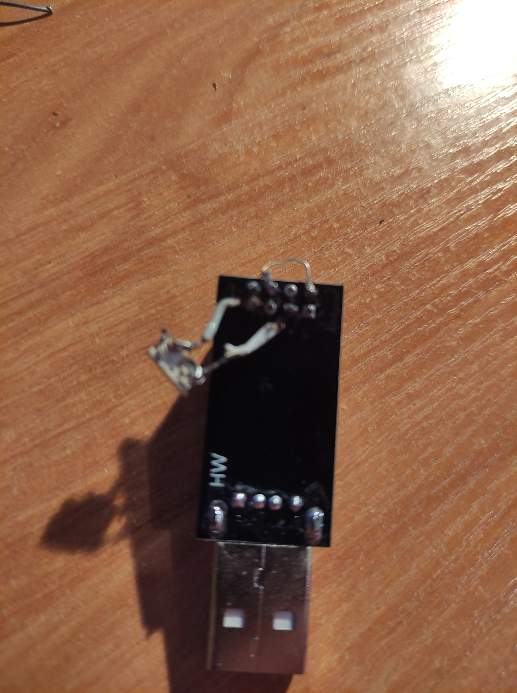
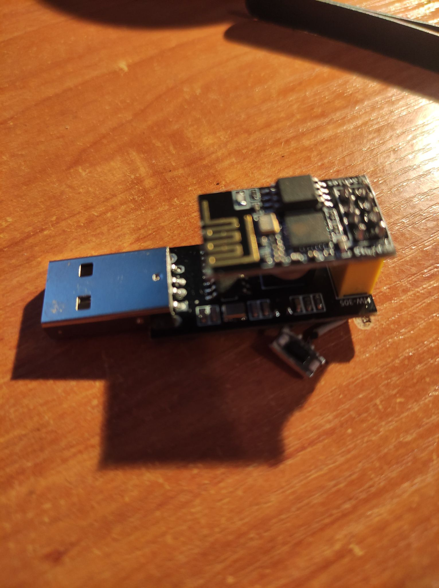

# ESP-01 12 Led strip Controller 

ESP-01 as a controller for the 12v LED strip  

## Prepare Programmer 

Solder Pins like shown in the photo. Those pins are GPIO1 and GND and 3V3 and EN. First one should be switch or button and second one should be a jumper 



Now you can insert ESP-01 into the programmer 



## Flash ESP-01 

Install esptools 
```
brew install esptools
```
or 
```
pip3 install esptools
```
Connect Programmer to the USB port with button pressed  and hold it for like 2 seconds

Run this command to flash the ESP with WLED 
```
/opt/homebrew/Cellar/esptool/3.3/bin/esptool.py write_flash 0x0 ./WLED_0.13.1_ESP01.bin
```
Connect to the WLED_AP network. It should have password like `wled1234`.

## Solder ESP-01 instead of IR Controller 

Wire it similar to this:


This tutorial helped me tremendously to understand LED basics
https://www.makeuseof.com/tag/connect-led-light-strips-arduino/