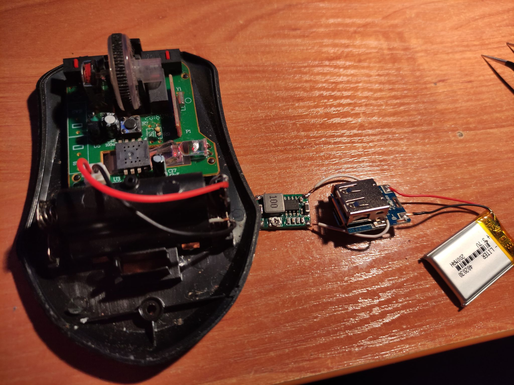
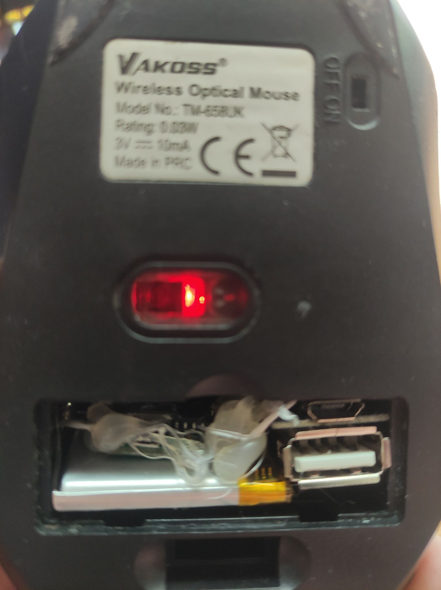

# Mouse mod AAA -> Li-Ion

This was made to modify my wireless mouse to use Li-Ion rechargeable batteries instead of AAA ones. 

## Components
1. Mouse (duhhhh)
1. Lithium Battery Charging module (The best one would be TP4056 but I used whatever was available)
1. Step down voltage regulator (I used standard mini one)
1. 3.7V Battery (mine was strange because it was actually 5V but regardless I will lower voltage to 3V)

## Actions 
1. Solder Battery to the BAT - and + of the Charging module
1. Solder OUT of the charging module to the IN in the Voltage Regulator (In my case Out was the rightmost and leftmost PINs of the USB)
1. Regulate Voltage to the 3V
1. Solder Regulator to the Battery Pack IN in the mouse 

